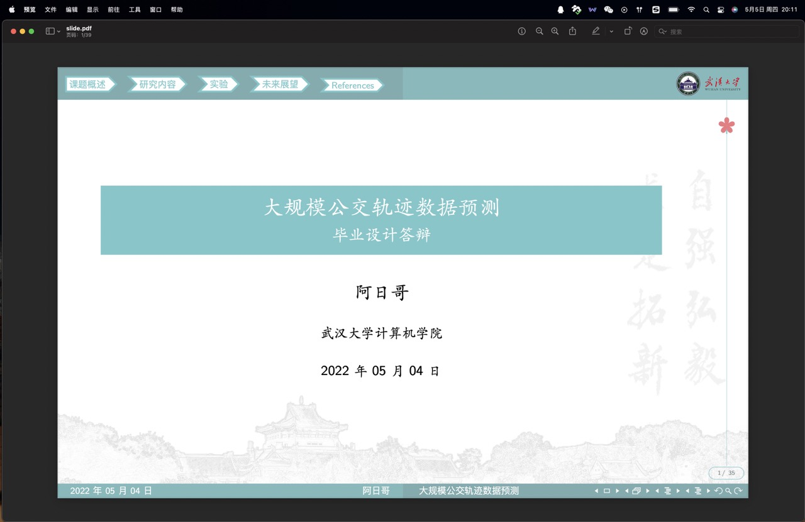
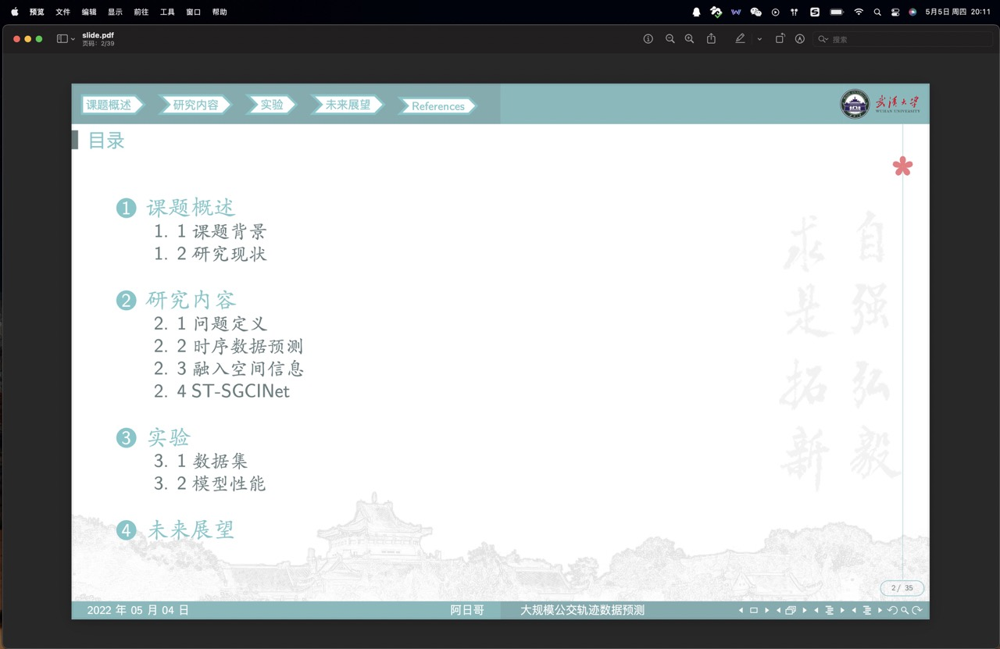
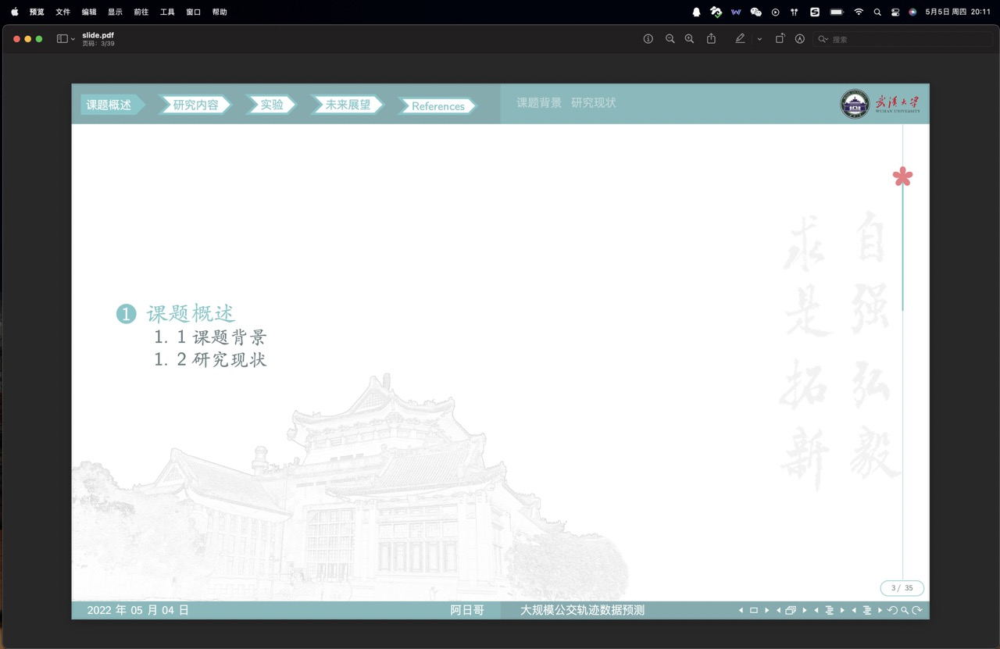
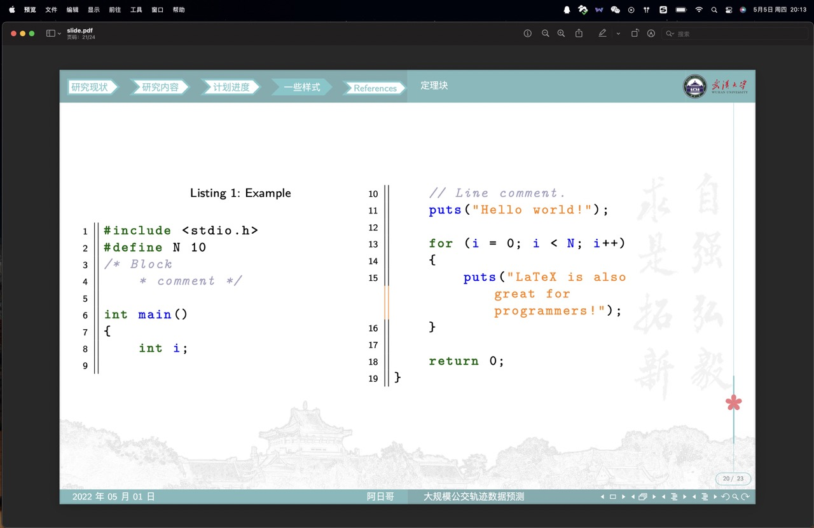
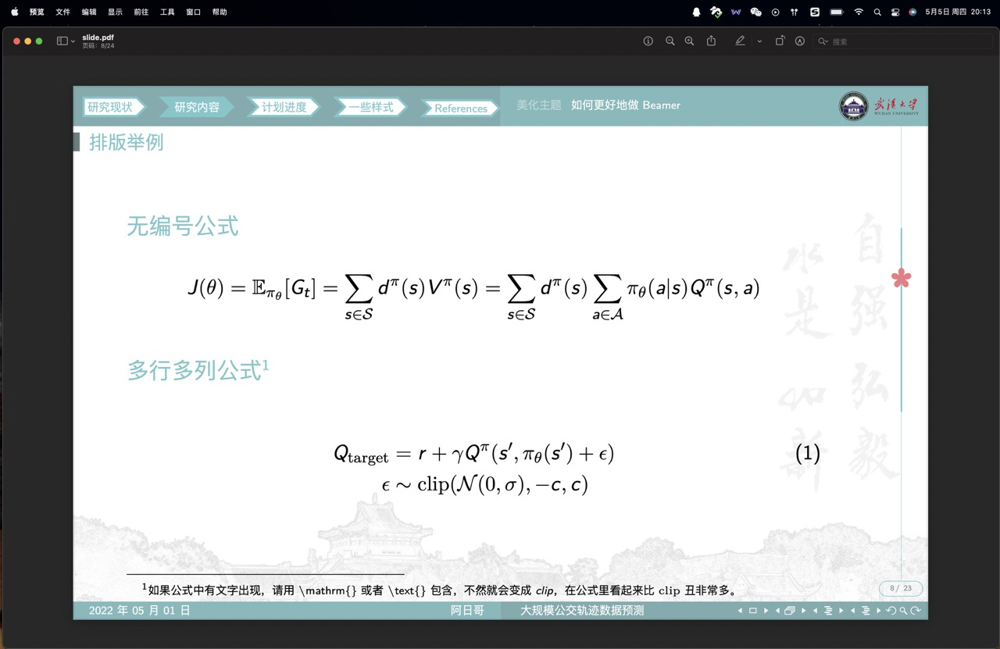
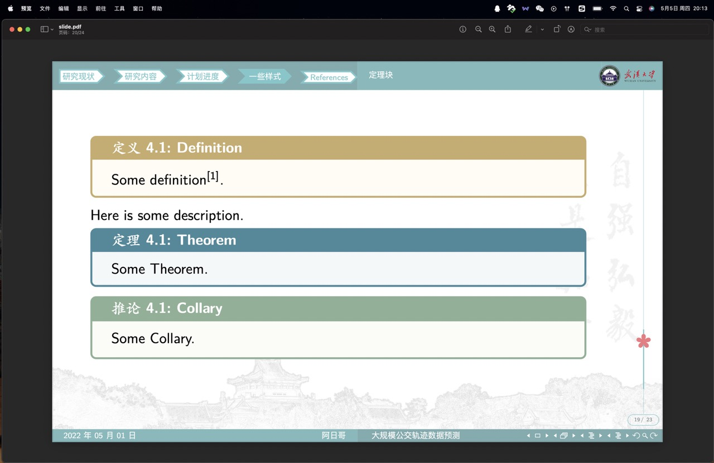
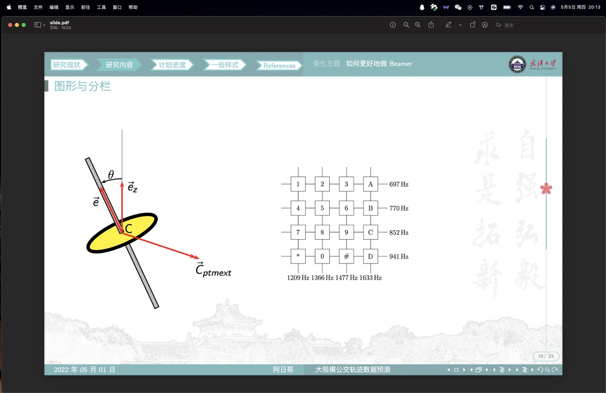
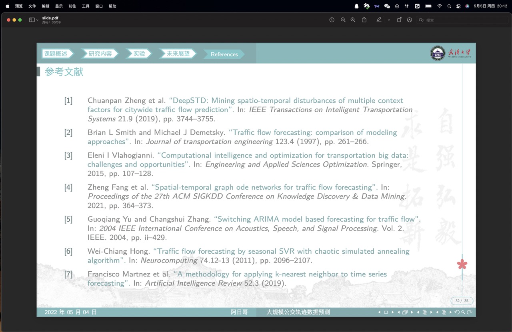
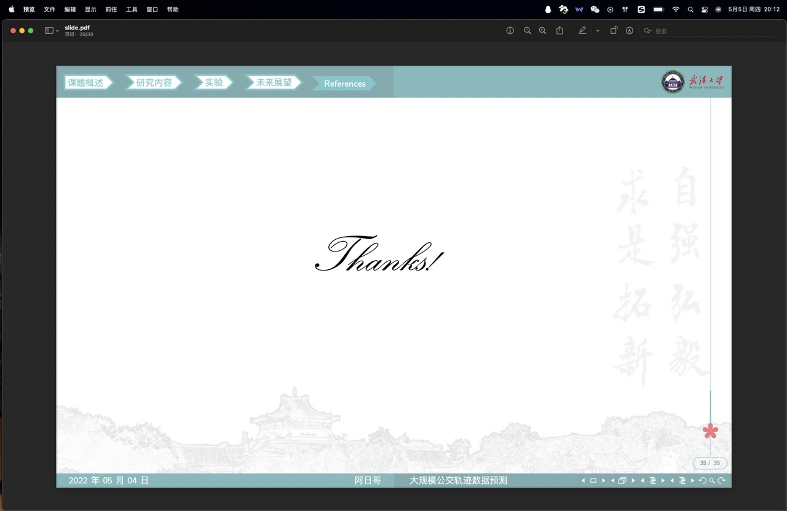

# WHU-Beamer 武汉大学Beamer模板

自己「魔改」的一个武汉大学的Beamer主题。大部分代码都是从其它已有的主题中移植、整合过来的。武大师生可用于各种报告、展示、答辩等场景。

模板仍在不断完善优化中，主要参考了以下模板：
- [四川大学Beamer模板](https://github.com/FvNCCR228/SCU_Beamer_Slide-demo)
- [清华大学Beamer模板](https://github.com/tuna/THU-Beamer-Theme/)
- [武汉大学主题Beamer模板](https://github.com/T0nyX1ang/WHU-BeamerTemplate/tree/v1.4.0)「特别感谢」从中移植了🌸进度条。

## 使用指南

### 快速开始

直接下载本项目的压缩包，修改pages文件夹下的内容，制作你自己的幻灯片。
文件夹分类如下：
- pages：存放你的幻灯片内容。
- images：存放你的幻灯片需要使用的图片。
- codes：存放你需要展示的代码。
- ref：存放参考文献。

### 版本更新

更新时只需到本仓库下载最新版本的WHU-Beamer.sty样式文件，并在你的项目中将其替换成最新的版本即可。

### 模板比例

目前模板支持16:9和16:10的比例，默认为16:10，后续会考虑增加其他比例。

``` latex
\usepackage [
    ContentMuticols=false, 
    AspectRatio=1610 % 此处指定页面比例，目前支持1610（16:10）和169（16:9）
] {WHU-Beamer}
```

除了在`\usepackage`中指定比例外，还需要在slide.tex的文档类型中指定比例：

```latex
\documentclass[aspectratio=1610]{beamer}
```

### 模板颜色

目前暂时支持武大的珞珈青和樱花粉、清华的紫色以及川大模板中定义的几个颜色（whucyan、whusakura、thupurple、scured、scublue、scuegreen、scuyellow）。

目前的版本中，如需要修改颜色，请在slide.tex文件中引入WHU-Beamer时指定上述颜色。

```latex
\usepackage [
    ContentMuticols=false,
    AspectRatio=1610,
    ThemeColor=whusakura % 指定模板颜色. 支持 whucyan | whusakura | thupuple | scured | scublue | scugreen | scuyellow .
] {WHU-Beamer}
```

另外页眉的校徽也支持深色和浅色的选项，默认为浅色。如需要使用深色校徽，请指定`IconColor`参数为`dark`。

```latex
\usepackage [
    ContentMuticols=false, % 目录是否分栏
    AspectRatio=1610, % 页面比例
    ThemeColor=whusakura, % 模板颜色 支持 whucyan | whusakura | thupuple | scured | scublue | scugreen | scuyellow .
    IconColor=dark
] {WHU-Beamer}
```

### 关于引用

请使用`\supercite`命令以启用上标引用。


## 注意事项

使用Windows的朋友们推荐安装TeXLive，使用Macos的朋友们推荐安装MacTeX。编辑器建议使用Vscode并配置LaTeX Workshop插件。
- 请使用xelatex进行编译，否则可能报错。
- 依据目前的导航条样式，建议大家将幻灯片分四或五个Part，每个Part标题四个字概括，如此最为美观。


## 预览


















